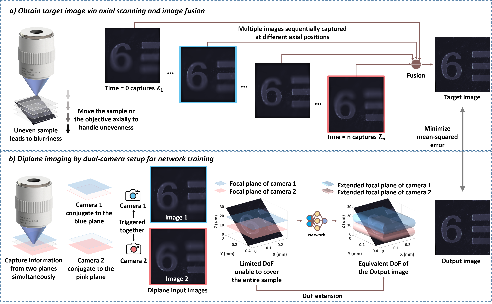

# Diplane network for DOF extension
This repository is the pytorch implementation of diplane network for depth-of-field (DOF) extension in mircoscopic imaging.

## Introduction


**a)** When imaging uneven samples, the limit DOF of microscope objective often fails to entire sample surface in one shot. Multiple images 
are taken axially and fused to obtain the final target image. 

**b)** Our diplane network integrates the images captured from two focal planes
and outputs the image with extended DOF, reducing the acquisition time for imaging uneven samples.

## Prerequisites
The code has been tested using:
- Ubuntu 18.04
- Python 3
- NVIDIA GPU + CUDA CuDNN

## Usage
- Clone this repo:
```bash
git clone https://github.com/frankheyz/diplane
cd diplane
```

- Edit 'configs.py' to configurate training settings 
  - "image_path": path to the training input images 
  - "reference_img_path": path to the training reference images
  - ...


- Train:
```bash
python3 train_model.py 
```

- Test:
```bash
python3 model_inference.py 
```

## Citation
Cite our work via:
```
Extended depth-of-field microscopic imaging for intact histological samples via self-calibrated diplane network
```

## Acknowledgments
Our code is inspired by [SimVP](https://github.com/A4Bio/SimVP).